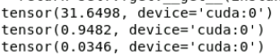

# Spectral Data Generation using Mitsuba and Training Using Splatfacto.

This repository contains code for generating spectral data (Inidividual and Encoded) using Mitsuba 3, the camera  spectral sensitivity curve as well as code for modifying the model to extract different bands and comparison for analysis.

## Repository Structure
```

├── Splatfactor/
│   ├── extracted_blue.py
│   ├── extracted_green.py
│   ├── extracted_red.py
│   ├── first_sample.pth
│   ├── new_eval.py
│   ├── second_sample.pth
├── _MACOSX/lego/
├── lego/
│   ├── cbox.xml
│   ├── [Lego meshes and textures]
├── Gaussian-like-curve.ipynb
├── mitsuba_Encoded1.ipynb
├── mitsuba_Encoded2.ipynb
├── mitsuba_Encoded3.ipynb
├── mitsuba_RGB.ipynb
├── mitsuba_band1.ipynb
├── mitsuba_band2.ipynb
├── mitsuba_band3.ipynb
├── mitsuba_band4.ipynb
├── mitsuba_band5.ipynb
├── mitsuba_band6.ipynb
├── mitsuba_band7.ipynb
├── mitsuba_band8.ipynb
├── mitsuba_band9.ipynb
├── mitsubaspectral.ipynb
└── pexels-fwstudio-33348-172289.jpg
```

### Notebooks
- **Gaussian-like-curve.ipynb**: Plots the sensitivity of the TOUCAN Multispectral Camera for bands 1 to 9.
- **mitsuba_Encoded1.ipynb**: Generates data for encoded bands 1-3.
- **mitsuba_Encoded2.ipynb**: Generates data for encoded bands 4-6.
- **mitsuba_Encoded3.ipynb**: Generates data for encoded bands 7-9.
- **mitsuba_RGB.ipynb**: Handles Standard RGB rendering.
- **mitsuba_band1.ipynb**: Generates data for individual spectral band 1.
- **mitsuba_band2.ipynb**: Generates data for individual spectral band 2.
- **mitsuba_band3.ipynb**: Generates data for individual spectral band 3.
- **mitsuba_band4.ipynb**: Generates data for individual spectral band 4.
- **mitsuba_band5.ipynb**: Generates data for individual spectral band 5.
- **mitsuba_band6.ipynb**: Generates data for individual spectral band 6.
- **mitsuba_band7.ipynb**: Generates data for individual spectral band 7.
- **mitsuba_band8.ipynb**: Generates data for individual spectral band 8.
- **mitsuba_band9.ipynb**: Generates data for individual spectral band 9.

### Additional Files

- **Splatfactor/**:
  - **extracted_blue.py**: Extracts and processes the blue channel data.
  - **extracted_green.py**: Extracts and processes the green channel data.
  - **extracted_red.py**: Extracts and processes the red channel data.
  - **first_sample.pth**: PyTorch tensor file containing the first sample.
  - **second_sample.pth**: PyTorch tensor file containing the second sample.
  - **new_eval.py**: Evaluation script to compare two samples using PSNR, SSIM, and LPIPS metrics.
- **lego/**: Contains the `cbox.xml` scene file, along with all necessary Lego meshes and textures for rendering.
- **pexels-fwstudio-33348-172289.jpg**: Image used as a background texture for the LEGO model.

### `extracted_blue.py`, `extracted_green.py`, `extracted_red.py`
These scripts extract and process the color channel data for blue, green, and red, respectively. They are used to analyze and manipulate separate band extractions.

### `first_sample.pth` and `second_sample.pth`
These files contain PyTorch tensor data for the first and second samples used for evaluation. They are loaded and compared using the `new_eval.py` script.

## Spectral Sensitivity Curve
The spectral sensitivity of the TOUCAN Multispectral Camera is defined by a set of Gaussian functions representing different spectral bands. The following Python code in `Gaussian-like-curve.ipynb` generates and plots these sensitivity curves:

```python
import matplotlib.pyplot as plt
import numpy as np

def gaussian(x, mu, sigma, max_value):
    return max_value * np.exp(-0.5 * ((x - mu) / sigma)**2)

bands = [
    {"center": 431, "fwhm": 65, "max_t": 0.36},
    {"center": 479, "fwhm": 47, "max_t": 0.45},
    {"center": 515, "fwhm": 42, "max_t": 0.49},
    {"center": 567, "fwhm": 37, "max_t": 0.54},
    {"center": 611, "fwhm": 36, "max_t": 0.55},
    {"center": 666, "fwhm": 34, "max_t": 0.56},
    {"center": 719, "fwhm": 33, "max_t": 0.53},
    {"center": 775, "fwhm": 31, "max_t": 0.51},
    {"center": 820, "fwhm": 31, "max_t": 0.49},
]

wavelengths = np.linspace(400, 900, 1000)
sensitivity_curves = np.zeros((10, len(wavelengths)))

for i, band in enumerate(bands):
    sigma = band["fwhm"] / 2.355
    sensitivity_curves[i, :] = gaussian(wavelengths, band["center"], sigma, band["max_t"])

plt.figure(figsize=(12, 8))
for i, band in enumerate(bands):
    plt.plot(wavelengths, sensitivity_curves[i, :], label=f'Band {i+1} (λc = {band["center"]} nm, FWHM = {band["fwhm"]} nm, Tmax = {band["max_t"]*100}%)')

plt.title('Spectral Sensitivity of TOUCAN Multispectral Camera')
plt.xlabel('Wavelength (nm)')
plt.ylabel('Relative Sensitivity')
plt.legend()
plt.grid(True)
plt.show()
```

## Sample Code for Data Generation for Band 1

The following sample code demonstrates how to generate data for band 1 using the Mitsuba renderer:

```python
import mitsuba as mi
mi.variants()
mi.set_variant("scalar_spectral")
scene = mi.load_file("lego/cbox.xml")

from mitsuba import ScalarTransform4f as T

def load_sensor(r, phi, theta):
    origin = T.translate([0, -1.2, 0]) @ T.rotate([0, 1, 0], phi).rotate([1, 0, 0], theta) @ mi.ScalarPoint3f([0, 0, r])

    return mi.load_dict({
        'type': 'perspective',
        'fov': 39.37,
        'to_world': T.look_at(
            origin=origin,
            target=[0, -3.7, 0],
            up=[0, 1, 0]
        ),
        'sampler': {
            'type': 'independent',
        },
        'film': {
            'type': 'specfilm',
            'width': 2000,
            'height': 2000,
            'band1': {
                'type': 'spectrum',
                'value': [(400.0, 0.01), (415.0, 0.15), (431.0, 0.36), (445.0, 0.15), (460.0, 0.01)]
            }
        },
    })

radius = 2
phis = [20.0*(i+1) for i in range(10)]
thetas = [20.0*(j+1) for j in range(10)]

sensors = []
for phi in phis:
    for theta in thetas:
        sensors.append(load_sensor(radius,theta,phi))
sensor_count = len(sensors)

images = [mi.render(scene, spp=512, sensor=sensor) for sensor in sensors]

import os
folder_name = "rendered_images"

os.makedirs(folder_name, exist_ok=True)

for i, image in enumerate(images):
    filename = f"{folder_name}/view_{i+1:04d}.png"
    mi.util.write_bitmap(filename, image)
    
print(f"Rendered images saved to: {folder_name}")
```


## Sample Code For Extracting different Bands from the Model. 

### Replicate the R Channel in B and G Channels for Both Ground Truth and Predicted Images

In the `extracted_red.py` file, the method that replicates the R channel in the B and G channels for both ground truth and predicted images is presented. This is done to facilitate certain image quality assessments and evaluation. 

This is the relevant function with the corresponding extraction logic for R values in B and G. 

```python
def get_image_metrics_and_images(
    self, outputs: Dict[str, torch.Tensor], batch: Dict[str, torch.Tensor]
) -> Tuple[Dict[str, float], Dict[str, torch.Tensor]]:
    """Writes the test image outputs.

    Args:
        image_idx: Index of the image.
        step: Current step.
        batch: Batch of data.
        outputs: Outputs of the model.

    Returns:
        A dictionary of metrics.
    """
    gt_rgb = self.composite_with_background(self.get_gt_img(batch["image"]), outputs["background"])
    predicted_rgb = outputs["rgb"]

    # Replicate the R channel in B and G channels for both ground truth and predicted images
    gt_rgb_r = gt_rgb[:, :, 0:1]  # Extract R channel
    gt_rgb = torch.cat([gt_rgb_r, gt_rgb_r, gt_rgb_r], dim=2)  # Replicate R channel into G and B

    predicted_rgb_r = predicted_rgb[:, :, 0:1]  # Extract R channel
    predicted_rgb = torch.cat([predicted_rgb_r, predicted_rgb_r, predicted_rgb_r], dim=2)  # Replicate R channel into G and B

    combined_rgb = torch.cat([gt_rgb, predicted_rgb], dim=1)

    # Switch images from [H, W, C] to [1, C, H, W] for metrics computations
    gt_rgb = torch.moveaxis(gt_rgb, -1, 0)[None, ...]
    predicted_rgb = torch.moveaxis(predicted_rgb, -1, 0)[None, ...]

    psnr = self.psnr(gt_rgb, predicted_rgb)
    ssim = self.ssim(gt_rgb, predicted_rgb)
    lpips = self.lpips(gt_rgb, predicted_rgb)

    # all of these metrics will be logged as scalars
    metrics_dict = {"psnr": float(psnr.item()), "ssim": float(ssim)}  # type: ignore
    metrics_dict["lpips"] = float(lpips)

    images_dict = {"img": combined_rgb}

    return metrics_dict, images_dict
```

This method:
1. Extracts the red (R) channel from the ground truth and predicted images
2. Replicates the R channel across the green (G) and blue (B) channels.
3. Combines the ground truth and predicted images side-by-side.
4. Computes PSNR, SSIM, and LPIPS metrics for the images.


## Sample Code For Comparing only the predicted output as saved Tensors for Band1 and Band1_Extracted
The  `new_eval.py` script is used to compare two samples (both predicted) for two different training instance (Band1 and Band1_Extracted) stored in `first_sample.pth` and `second_sample.pth` using three image quality metrics: PSNR (Peak Signal-to-Noise Ratio), SSIM (Structural Similarity Index Measure), and LPIPS (Learned Perceptual Image Patch Similarity). The script computes the metrics for similarity between the two samples, and visualizes the results.

This is the `new_eval.py` script:

```python
import torch
from pytorch_msssim import SSIM
from torchmetrics.image import PeakSignalNoiseRatio
from torchmetrics.image.lpip import LearnedPerceptualImagePatchSimilarity
import matplotlib.pyplot as plt

# Used in the model to save the predicted image to a tensor file.
# torch.save(predicted_rgb, 'first_sample.pth')
# torch.save(predicted_rgb, 'second_sample.pth')

device = torch.device("cuda" if torch.cuda.is_available() else "cpu")

first_sample = torch.load('first_sample.pth', weights_only=True).to(device)
second_sample = torch.load('second_sample.pth', weights_only=True).to(device)
# second_sample = torch.load('first_sample.pth', weights_only=True).to(device)

psnr = PeakSignalNoiseRatio(data_range=1.0).to(device)
ssim = SSIM(data_range=1.0, size_average=True, channel=3)
lpips = LearnedPerceptualImagePatchSimilarity(normalize=True).to(device)

psnr_value = psnr(first_sample, second_sample)
ssim_value = ssim(first_sample, second_sample)
lpips_value = lpips(first_sample, second_sample)

metrics = ['PSNR', 'SSIM', 'LPIPS']
values = [psnr_value, ssim_value, lpips_value]

plt.title('Comparison of PSNR, SSIM, and LPIPS Metrics')
plt.xlabel('Metrics')
plt.ylabel('Values')

from pprint import pprint

for i, value in enumerate(values):
    plt.text(i, value + 0.05, f'{value:.2f}', ha='center')
    pprint(value)

plt.show()

```
While computing PSNR and SSIM between two predicted or reconstructed images is technically feasible, it is not a common practice in the field of 3D reconstruction or image processing. The primary reason for this is that PSNR and SSIM is traditionally used to measure the fidelity of a reconstructed image with respect to a ground truth reference. Computing the metrics against the groundtruth is the traditional practice. To ascertain the efficiency  of the implemented approach, I first computed the similarity using the traditional method (Groundtruth and predicted) for both Band1 and Band1_extracted and compared the resulting metrics values which shows a very good performance. Additionally, I created a custom code `new_eval.py` and saved only the predicted_image from the model for both the Band1 and Band1_extracted separately and computed the similarity for these tensors. The image below shows the result using the custom code which are very comparable results with the traditional method used. 



1. The first tensor resulting value correspond to the PSNR
2. The second tensor resulting value correspond to the SSIM
3. The third tensor resulting value correspond to the LPIPS

Overall, the results obtained has concluded the efficiency of encoding much better than training individual spectral bands in all possible scenarios.

## Acknowledgements

- [Mitsuba Renderer](https://www.mitsuba-renderer.org/) for providing the rendering framework.
- [Nerfstudio](https://docs.nerf.studio/) for providing the foundational code and concepts used in the above implementation.
